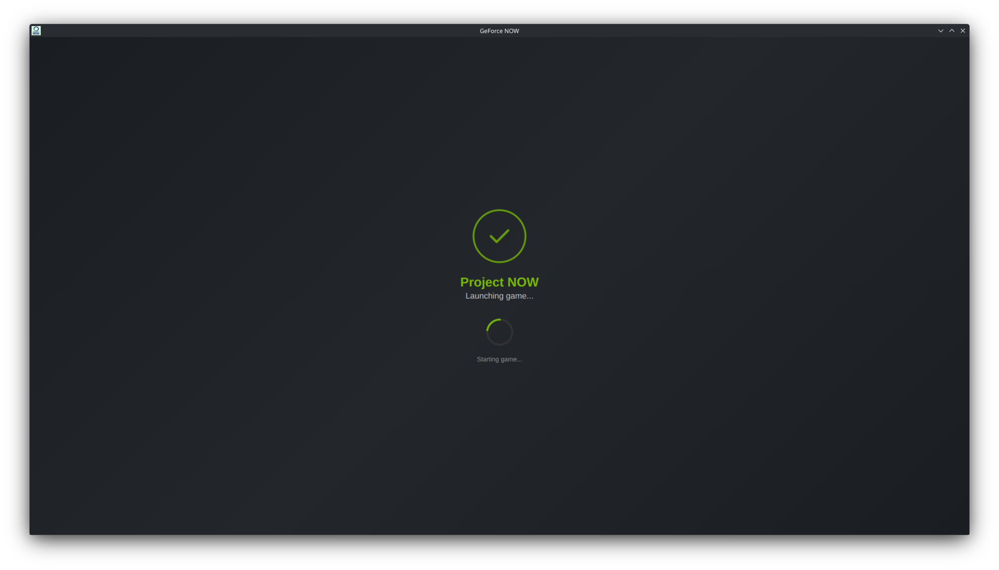

# Project NOW

**Project NOW** is next-gen application designed to enhance the GeForce NOW experience. Originally created to address the lack of native GeForce NOW support on Linux, this app also provides functionality for macOS and Windows users. Our goal is to refine the user interface and offer custom features for an improved experience.

## **Screenshots**


<p align="center">
  
  
</p>

## 🚀 **Features**

- **Up to 360 FPS support (GFN ultimate required)**
- **Up to 5K resolution support (GFN performance or up required)**
- **Ultrawide resolutions support (21:9, 32:9)**
- **30FPS support (GFN performance or up required for some reason)**
- **720p resolution support (GFN performance or up required for some reason)**
- **Inactivity notification:** Alerts you when you're about to be kicked due to inactivity.
- **Automute:** Mutes the game when the window is not in focus.
- **Auto refocus:** Alt-tabs you back into the game if you're unfocused when inactivity timer starts (both autofocus and inactivity notifications must be enabled).
- **Button to reset all settings to their default values.**
- **Support for smaller screens:** added scrollable areas.
- **Info tooltips added in the settings section.**
- **Enhanced UI**: Project NOW aims to improve the user interface of GeForce NOW, providing a more intuitive and enjoyable experience.
- **Custom Discord Rich Presence**: Show off your gaming status with personalized Discord Rich Presence. Display game details and status updates directly in your Discord profile.
- **Instant App Switch**: Automatically switch to Project NOW once your gaming rig is ready for action!
- **Notifications**: Get notified once your gaming rig is ready for action!

## 🛠️ **Planned Features**

We have several exciting features planned to further enhance your experience:

- **HDR support**
- **Surround sound support**
- **Account Switching**: Easily switch between different connected accounts within GeForce NOW.
- **Automatic Game Startup**: Customize which game starts automatically when the app launches.

## ⚠️ **Disclaimer**

Project NOW is an independent project and is not affiliated with, sponsored by, or endorsed by Nvidia or GeForce NOW. All trademarks and logos used are the property of their respective owners. The app is provided as-is, and the developers are not responsible for any issues or damages that may arise from its use.

## 📦 **Installation**

Visit our [Release](https://github.com/oaojfr/Project-NOW/releases) page, where you can find newest builds of Project NOW in packages like: **zip** (binary version), **deb**, **AppImage**, **rpm** and **exe**.

## 🎮 **Usage**

Press `Ctrl+I` to open sidebar to access Project NOW features.

## 💻 **How to use 2K, 4K & 120 FPS streaming**

Press `Ctrl+I` to open sidebar and change **Resolution** and **FPS** to your liking.
**DO NOT USE** native GeForce NOW settings for resolution and FPS, Project NOW **doesn't** alter GeForce NOW settings, so you still see 1080p max resolution and 60 FPS. Project NOW override these values.


## 🛠️ **Build**

To get started with Project NOW, follow these steps:

1. Clone the repository:

    ```bash
    git clone https://github.com/oaojfr/Project-NOW.git
    ```

2. Navigate to the project directory:

    ```bash
    cd Project-NOW
    ```

3. Install dependencies:

    ```bash
    yarn install
    ```

4. Run the application:
    ```bash
    yarn start
    ```

## 💬 **Contributing**

We welcome contributions from the community! For the contribution guide please see: [Contributing](CONTRIBUTING.md)

## 📜 **License**

Project NOW is licensed under the [MIT License](LICENSE). See the [LICENSE](LICENSE) file for more details.

## 📫 **Contact**

For questions, feedback, or suggestions, feel free to reach out to me:

- [GitHub Issues](https://github.com/oaojfr/Project-NOW/issues)
- Email: [astral.vixen.hu@gmail.com](mailto:astral.vixen.hu@gmail.com)
- Discord: [Join my discord](https://discord.gg/p5vRgQwZ9K)
